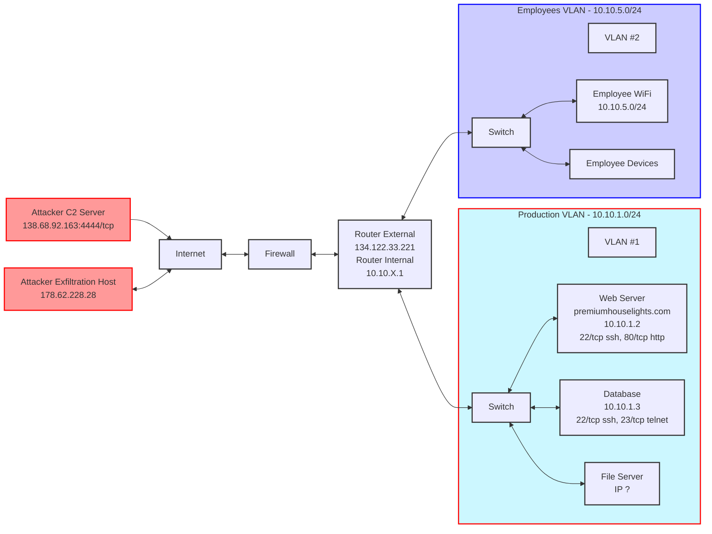

Case topology.
1. Exposed SSH and HTTP ports on Web Server
2. Telnet on Database (insecure protocol)
3. Unknown File Server IP (potential security gap)
4. Potential for lateral movement between VLANs
5. External attacker C2 and exfiltration servers"]
