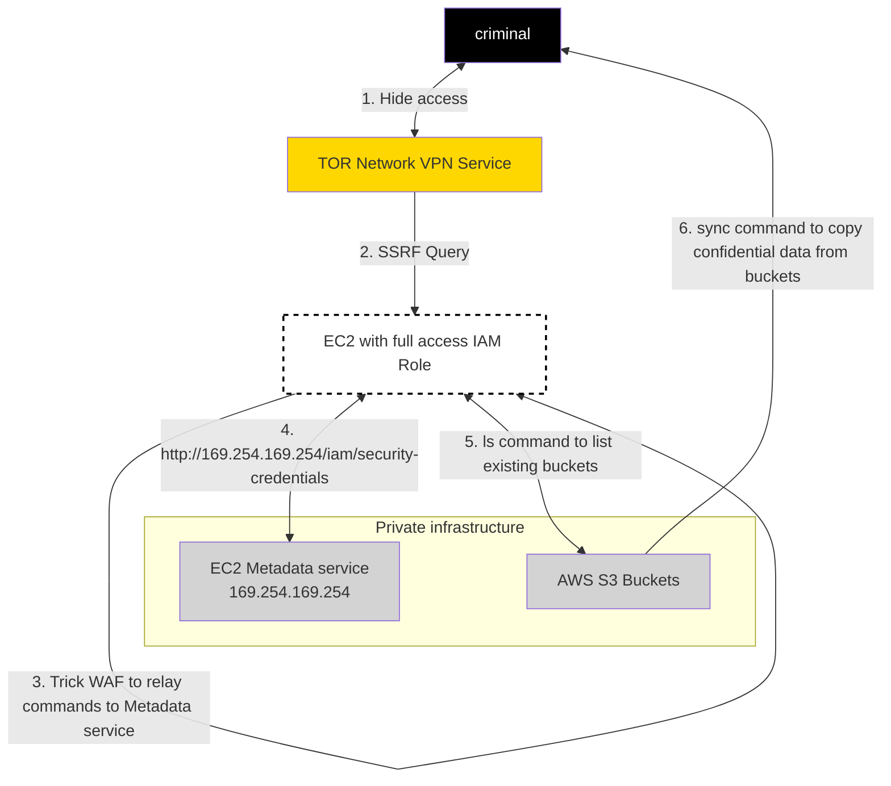

#### reads
- [x] https://web.mit.edu/smadnick/www/wp/2020-16.pdf

|parts|reading|
|-|-|
|text/Summary|1. Introduction   2. Related Articles  Methodological  3. Considerations  __...__|
|case start   __image bellow__ |6.2 Technical Assessment of the Capital One Incident|
> image of the case [img]

___...___
|parts|reading|
|-|-|
|Explanation brief of steps   1,2,3,4,5,6 |6.2 after [img]|
| mapping of steps to -> MITRE ATT&CK  Table of ATT&CK tactics/techniques used |6.2 end|
> Table of ATT&CK tactics/techniques used

| MITRE Tactic "Stage" | Step of the attack | ATT&CK # |
| -| -|-|
|C2|__1__|T1188|
|Innitial access|__2__|T1190|
|Innitial access|__3__|N/A|
|Innitial access|__4.__|T1078|
|Execution|__4.__|T1059|
|Discovery|__5__|T1007|
|Exfiltration|__6__|T1048|

___...___
|parts|reading|
|-|-|
|Mapping CSF NIST controlls  (Failed Controls v. incident) -> NIST CSF |6.4 Assessment of Technical Controls  Versus Normative Standards Applied to the Capital One Incident

- [ ] [NIST RMF CONTROLS](https://csf.tools/reference/nist-sp-800-53/r5/) 
- [ ] [NIST __CSF__ CONTROLS](https://csf.tools/reference/nist-cybersecurity-framework/v2-0/) <-
> Table of FAILED Controls CSF NIST:

| MITRE Tactic "Stage" | Step of the attack| _Mitigation_ "Technical Controls"| CSF NIST Controls (that failed)|
|-|-|-|-|
|C2|__1__ T1188|Firewall, host access rules: deny(TOR node, flagged proxy) -------- IDS/IPS alert on success from flagged IP|[ID.AM-4](https://csf.tools/reference/nist-cybersecurity-framework/v2-0/id/id-am/id-am-04/) PR.DS-5 DE.AE-1 DE.CM-1,DE.CM-6,DE.CM-7, DE.DP-2
|Innitial access|__2__ T1190|use WAF, Vulnerability scanner|PR.IP-12 PR.PT-1,PR.PT-3 DE-AE-3 DE.CM-1,DE.CM-6,DE.CM-7,DE.CM-8 DE.DP-2|
|Innitial access|__3__ N/A|Early detection by Vulnerability scanner |PR.IP-12 PR.PT-1,PR.PT-3 DE-AE-3 DE.CM-7,DE.CM-8 DE.DP-2|
|Innitial access|__4.__ T1078|Monitor , Auddit: Admin acc.|PR-AC-1,PR-AC-4,PR-AC-6,PR-AC-67 PR.IP-1 PR-PT-1,PR-PT-3 DE.CM-6,DE.CM-7 DE.DP-2|
|Execution|__4.__ T1059|Track commands on AWS acc. |...|
|Discovery|__5__ T1007|Track commands on AWS acc.|same as ^above _+plus_ PR.DS-5|
|Exfiltration|__6__ T1048|Outbound traffic monitor|...|

___...___
|parts|reading|
|-|-|
|explain attack step list controlls talk about control mitigation power|6.5 Details of __Two__ of the Failed Controls 6.5.1 Case Study: "Obtain access credentials (AccessKeyld and SecretAccessKey)" 6.5.2 Case Study: "Data Exfiltration"|
| Discussion & Recommendation TONE CHANGE, _persuasive writting_ | 7. Discussion and Recommendations|
|'GRC' only works when applied correctly  _don't fuck up GRC_ Trust us|7. Discussion and Recommendations|
| Where is the  g a p |7.2 The cyber security GAP between Governance, Management and IT|
|Fundamental RECOMMENDATIONS |7.3. (1,2,3,4,5)|
|Summary, global view, call to action (sell) |8. Final considerations |
|Future work, Gloal focus|9. Future work|
|Acknowledgments,|References|10. Acknowledgments, 11. References|
