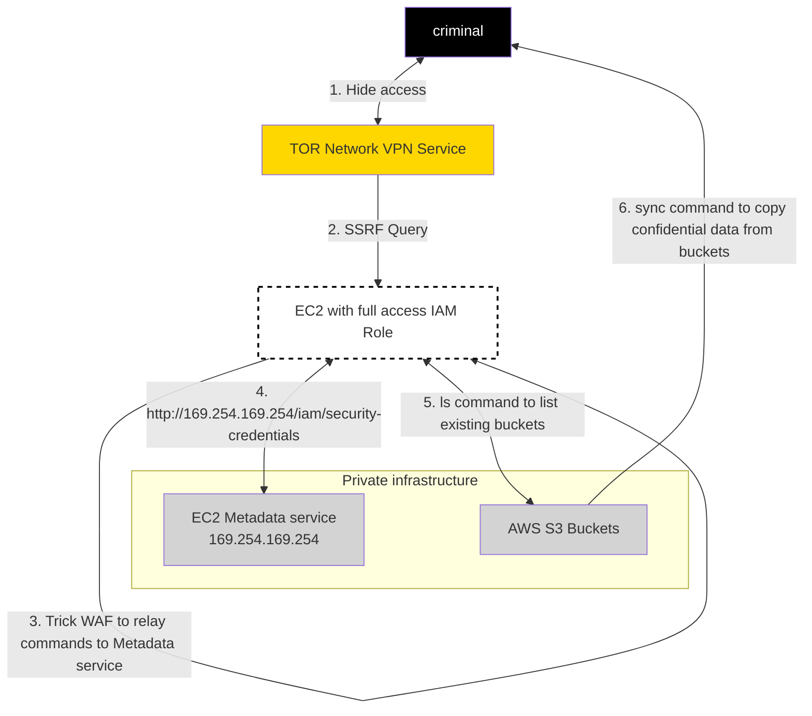

#### reads
- [x] https://web.mit.edu/smadnick/www/wp/2020-16.pdf

|parts|reading|
|-|-|
|text/Summary|1. Introduction   2. Related Articles  Methodological  3. Considerations  __...__|
|case start   __image bellow__ |6.2 Technical Assessment of the Capital One Incident|
> image of the case [img]

___...___
|parts|reading|
|-|-|
|Explanation brief of steps   1,2,3,4,5,6 |6.2 after [img]|
| mapping of steps to -> MITRE ATT&CK  Table of ATT&CK tactics/techniques used |6.2 end|
> Table of ATT&CK tactics/techniques used

| MITRE Tactic "Stage" | Step of the attack | ATT&CK # |
| -| -|-|
|C2|__1__|T1188|
|Innitial access|__2__|T1190|
|Innitial access|__3__|N/A|
|Innitial access|__4.__|T1078|
|Execution|__4.__|T1059|
|Discovery|__5__|T1007|
|Exfiltration|__6__|T1048|

___...___
|parts|reading|
|-|-|
|Mapping CSF NIST controlls  (Failed Controls v. incident) -> NIST CSF |6.4 Assessment of Technical Controls Versus Normative Standards Applied to the Capital One Incident
> Table of FAILED Controls CSF NIST:

| MITRE Tactic "Stage" | Step of the attack| _Mitigation_ "Technical Controls"| CSF NIST Controls (that failed)|
|-|-|-|-|
|C2|__1__ T1188|Firewall, host access rules: deny(TOR node, flagged proxy) -------- IDS/IPS alert on success from flagged IP|ID.AM-4, PR.DS-5, DE.AE-1, DE.CM-1, DE.CM-6,DE.CM-7, DE.DP-2
|Innitial access|__2__ T1190|use WAF, Vulnerability scanner|PR.IP-12 PR.PT-1,PR.PT-3 DE-AE-3 DE.CM-1,DE.CM-6,DE.CM-7|

HERE...

|Innitial access|__3__|N/A|
|Innitial access|__4.__|T1078|
|Execution|__4.__|T1059|
|Discovery|__5__|T1007|
|Exfiltration|__6__|T1048|
- Failed Controls discussion

- Discussion & Recommendation
> GAP
> 
>  principles (POLP, Access etc)
>
> Controlls

- Final.

6.5 Details of Two of the Failed Controls
6.5.1 Case Study: "Obtain access credentials (AccessKeyld and SecretAccessKey)"
6.5.2 Case Study: "Data Exfiltration"
7. Discussion and Recommendations
7.1 The Compliance impact on cyber security readiness
7.2 The cyber security GAP between Governance, Management and IT
7.3 Recommendations to mitigate and strengthen the standards based on Capital One case study
7.3.1 To avoid the improper adoption of compliance controls
7.3.2 To keep the controls relevant as the technology evolves
7.3.3 Multidisciplinary Skills
7.3.4 How to protect a Storage (S3) Cloud Environment
7.3.5 The need to manage the compliance window
8. Final considerations
9. Future work
10. Acknowledgments
11. References
