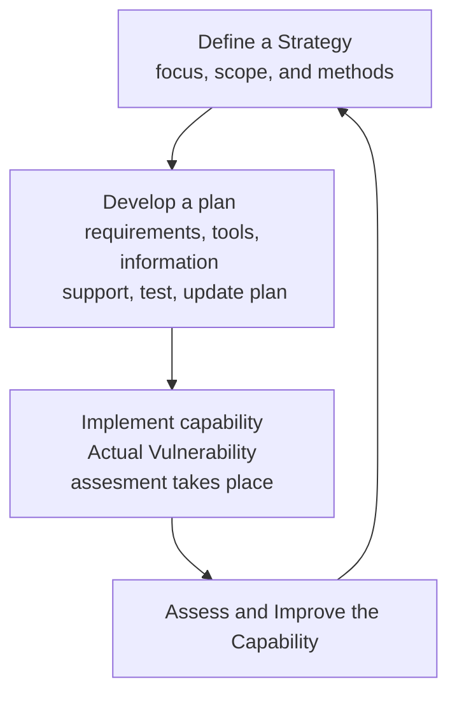

# Vulnerability Management Best Practices
Reading list
- [ ] https://nvlpubs.nist.gov/nistpubs/Legacy/SP/nistspecialpublication800-137.pdf
- [x] https://www.youtube.com/watch?v=Yo6lxcEP3QI
- [ ] https://www.cisa.gov/sites/default/files/publications/CRR_Resource_Guide-VM_0.pdf

### Vulnerability Management

- __Keep the business in focus__
> tie the entire process, right from the initial concept and buy-in stages through the final evaluation of the overall project, to the business, its goals, needs, and capabilities.

- __Don’t leave anyone out__
> ensure all required stakeholders, internal and external, and from all levels of the organization, are involved and reported to appropriately.

- __Plan, plan, plan__
> plan as much as possible, for all possibilities. Don’t forget a process for updating the plan.

- __Understand before acting__
> evaluate needs, capabilities, and options, for the business, the test, and the outcomes, before making decisions on methods, timings, and approaches.

- __Reports are key__
>  research, and report as thoroughly as possible on the results and the process, to ensure improvements can be decided on and implemented appropriately going forward.

-  __Keep policies in mind__
> company policy is a crucial part of the security and privacy controls, as well as the vulnerability monitoring and assessing process of an organization.

## Key Takeaways
Vulnerability assesments requires consultation, support,and __buy-in__ from all levels of the organization in order to be able to do the job effectively.

Vulnerability assessments are part of a larger ongoing process that monitors the vulnerability status of an organization.

Entire organization, especially upper levels, is an integral and critical part of the process of monitoring and managing the security and privacy controls and vulnerabilities therein within an organization.

Best practices for managing, completing, and maintaining monitoring and remediation efforts with regards to an organization’s security and privacy controls
