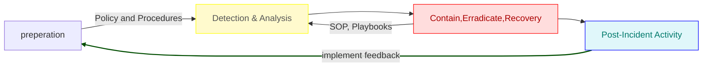

## NIST Incident Response Life Cycle (IRLC)
1. Preparation
    - The home of Policy and Procedure preparation
2. Detection and Analysis
3. Containment, Eradication and Recovery
    - The home of our Playbooks
4. Post Incident Activity

#### NIST Incident Response Life Cycle

## Key components of Preperation
# :key: :checkered_flag: :racing_car:

- __Policy and Procedure Development__: Establish clear incident response policies and procedures that outline roles, responsibilities, and actions to take during an incident.
- __Team Formation__: Set up a Computer Security Incident Response Team (CSIRT) with defined roles and responsibilities.
- __Tool and Technology Implementation__: Deploy essential security tools such as firewalls, intrusion detection/prevention systems (IDS/IPS), and endpoint detection and response (EDR) solutions.
- __Training and Awareness__: Conduct regular training sessions and simulations for the incident response team and other staff to ensure readiness.
- __Communication Plan__: Develop a communication plan that includes internal and external stakeholders, ensuring timely and accurate information dissemination during an incident.
- __Documentation and Playbooks__: Create detailed incident response playbooks and checklists to guide the team through various types of incidents.

## Key Post Incident Activity
# :anchor: :speaking_head: :football:
- __Incident Summary__: Provide a detailed account of what happened, including timelines and affected systems.
- __Response Evaluation__: Assess the effectiveness of the response actions taken, including containment, eradication, and recovery efforts.
- __Root Cause Analysis__: Identify the root cause of the incident and any contributing factors.
- __Lessons Learned__: Document key takeaways and areas for improvement.
- __Policy and Procedure Updates__: Recommend updates to policies, procedures, and playbooks based on the findings.
- __Training Needs__: Identify any gaps in knowledge or skills and plan for additional training.
- __Communication Review__: Evaluate the effectiveness of internal and external communication during the incident.

