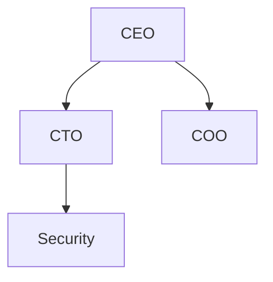
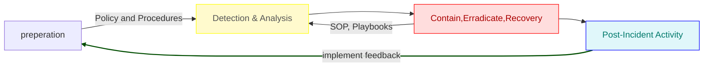

Incident Playbook Case Study
Compass Activity Link W6D3
https://web.compass.lighthouselabs.ca/p/cyber/days/w06d3/activities/3053

-  Company name
- Incident Response Plan
-  Date
-  Table of contents

__Revision History__
|Date|Version|Modification|Modifier|
|-|-|-|-|

- Test & Review Cycle
- Purpose & Scope
- Purpose
- Scope
-  Authority
-  Definitions
-  Identify
-  Response Team 
__Organization Diagram__

- Roles (role, definition)
- Responsibilities by role
- Contact information (Role, name, title, #,@)
- External Contacts(Role, Organization, name, title, #,@)
- Other Stakeholder Contact (Role, Organization,name, title, #,@)
- Incident type(Type, Description)
- Severity Matrix

| |2|1|0|
|-|-|-|-|
|2|__H__|H|M|
|1|H|M|L|
|0|M|L|L|

- Incident Handling
- Overview (Diagram) NIST RMF 7 step || NIST IRLC 4 step

- Steps Explanation:
- 1,2,3,4… N
- Playbooks, workflows, SOP
- Approvals
- Incident Response Plan Resposible (Who enforces THIS document)
- Incident Handler
- Refferences
