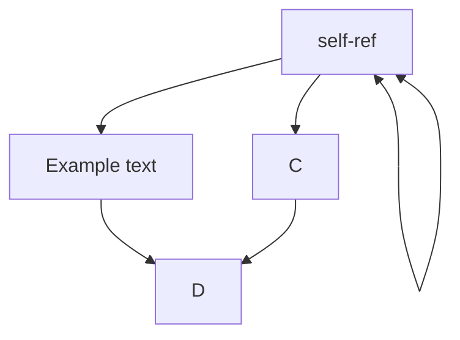

TRAFFIC LIGHT PROTOCOL (TLP)
https://www.first.org/tlp/

Resume Rubric
https://docs.google.com/document/d/1Sb2-6LsSSJo2_Zo46zaSw1aEZxoxcvKLgps7HbluJUo/edit

Flowchart automation: Use Mermaid files

https://app.diagrams.net/ \
Arrange > Insert > Advanced > Mermaid \
mermaid files automatically generate in github .md ! \
Open the code to see the mermaid script

