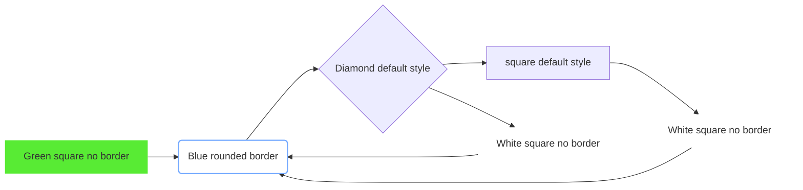
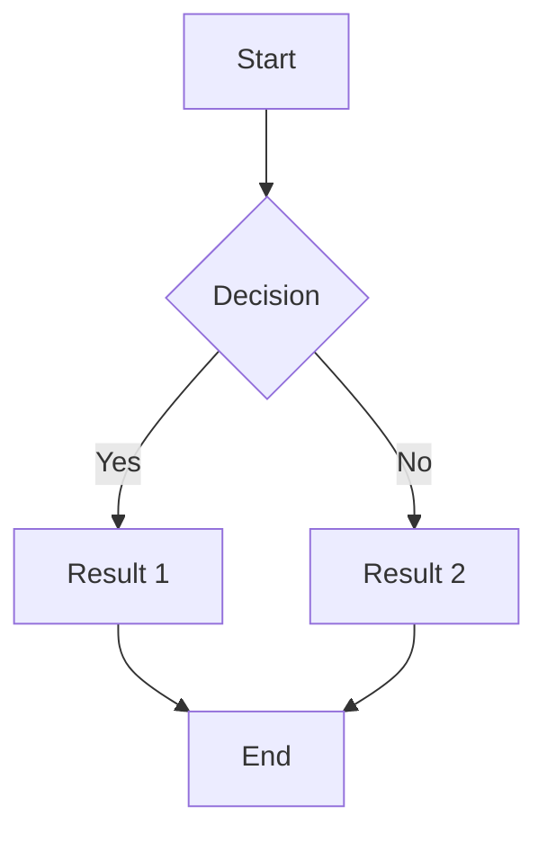

TRAFFIC LIGHT PROTOCOL (TLP)
https://www.first.org/tlp/

SLA : trigger points for escalations.

Resume Rubric
https://docs.google.com/document/d/1Sb2-6LsSSJo2_Zo46zaSw1aEZxoxcvKLgps7HbluJUo/edit

Flowchart automation: Use Mermaid files

https://app.diagrams.net/ \
Arrange > Insert > Advanced > Mermaid \
mermaid files automatically generate in github .md ! \
Open the code to see the mermaid script \
[Mermaid Docs](https://mermaid.js.org/intro/getting-started.html)
- fill:#ccf: This sets the background color of nodes, Hex.
- stroke:#333: This sets the border color, Hex.
- stroke-width:2px: This sets the border thickness, Pixel.
- TD : top down , LR: left to right 

