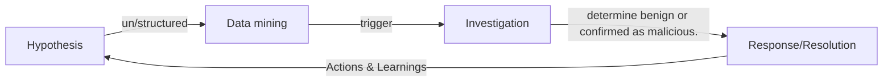

## dict
| term | def                                            |
|------|------------------------------------------------|
| UEBA | user and entity behavior analytics            |
| TTPs | Tactics, Techniques, and Procedures           |
| STIX | Structured Threat Information Expression      |
| TAXII| Trusted Automated eXchange of Indicator Information |
| CTI APIs | Cyber Threat Intelligence Application Programming Interfaces |
| SIEM|Security Information and Event Management|

## Do
- [ ] https://oasis-open.github.io/cti-documentation/stix/examples

## Reading
- [x] https://www.crowdstrike.com/cybersecurity-101/threat-hunting/#:%7E:text=Threat%20hunting%20is%20the%20practice,your%20initial%20endpoint%20security%20defenses
- [x] https://www.ibm.com/topics/threat-hunting

Threat hunter part of CERT/CIRT
    - Use of all 3 CTI types.
    - Assume threat present.
    - Analysis for Potential & Actual threat
    - Strong Blue team collaboration
    
Proactive techniques
    - Hypothesis Driven Investigations / unstructured hunt: experience, skill.
    - Structured: TTPs, CTI API, SIEM, [EDR](https://www.crowdstrike.com/cybersecurity-101/endpoint-security/endpoint-detection-and-response-edr/), STIX,TAXXI.

Baselining
    - Environment & operations 
    - UEBA

"In other words, threat hunting begins where threat intelligence ends." \
IBM: What is threat hunting? https://www.ibm.com/topics/threat-hunting

## Threat Hunting Five (5) Steps
Cyber threat hunting is a proactive security search through networks, endpoints, and datasets to hunt malicious, suspicious, or risky activities that have evaded detection by existing tools.

#### Step 1: Hypothesis
hypothesis can include a suspected attacker's tactics, techniques, and procedures (TTPs). \
Threat hunters use threat intelligence, environmental knowledge, and their own experience and creativity to build a logical path to detection.
- strutured hunt
- unstructured hunt
#### Step 2: Collect and Process Intelligence and Data
- plan for collecting, centralizing, and processing data.
- SIEM : insight, track record of activities in IT environment.
#### Step 3: Trigger
- Advanced detection tools point threat hunters to initiate investigation system /network.
#### Step 4: Investigation
- Investigative technology, can hunt or search potentially malicious anomalies in a system or network, determine benign or confirmed as malicious.
#### Step 5: Response/Resolution
- Data gathered from confirmed malicious activity can be entered into automated security technology to respond, resolve, and mitigate threats.
> Actions can include removing malware files, restoring altered or deleted files to their original state, updating firewall /IPS rules, deploying security patches, and changing system configurations
+ Leaning phase / improve your security against similar future attacks.

## Threat hunting maturity model

Threat hunting maturity = quantity & quality of data.
- Initial: At Level 0 maturity an organization relies primarily on __automated reporting__ and does __little or no routine data collection__.
- Minimal: At Level 1 maturity an organization incorporates threat intelligence indicator searches. It has a moderate or high level of routine data collection.
- Procedural: At Level 2 maturity an organization follows analysis procedures created by others. It has a high or extremely high level of routine data collection.
- Innovative: At Level 3 maturity an organization creates new data analysis procedures. It has a high or extremely high level of routine data collection.
- Leading: At Level 4 maturity, an organization __automates the majority of successful data analysis procedures__. It has a __high or extremely high level of routine data collection__.

Modern adversaries automate TTP to evade preventative defenses
## automation 
- Data Collections
- Investigation Process ( Greenbone, MITRE [cascade](https://github.com/mitre/cascade-server))
- Prevention Process (Once threat is identified, mitigations on networks, endpoints, and cloud.)
- Response Process (routine attacks, deleting customized script to isolate a compromised endpoint, deleting malicious files after isolation, automatically using backup info to restore data compromised in an attack.)

## Optimize Human Expertise Through Human Machine Teaming
- Never expect machines to be ethical or strategic
- Never expect humans to be good at searching large volumes of data at speed and scale or perform complex pattern matching.

